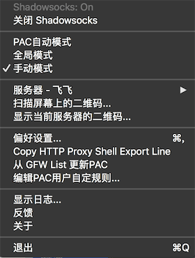
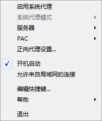
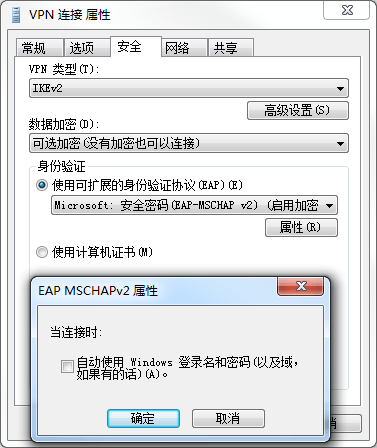

# 科学上网

## 目录
1. [服务端安装](#服务端安装)

    1. [通过docker安装Shadowsocks、Cisco IPSec（IPSec Xauth PSK）服务器（最快捷方式）](#通过docker安装shadowsockscisco-ipsecipsec-xauth-psk服务器最快捷方式)
    1. [Shadowsocks](#shadowsocks服务端安装)
    1. [IKEv2（IKEv1）](#ikev2ikev1服务端安装)
1. [客户端配置](#客户端配置)

    1. [Shadowsocks](#shadowsocks客户端配置)
    1. [IKEv2（IKEv1）](#ikev2ikev1客户端配置)
    1. [Cisco IPSec（IPSec Xauth PSK）](#cisco-ipsecipsec-xauth-psk客户端配置)

---
## 服务端安装

### 通过docker安装Shadowsocks、Cisco IPSec（IPSec Xauth PSK）服务器（最快捷方式）
>[docker](https://www.docker.com/)建议Linux内核在3.0以上。[Bandwagon](https://bwh1.net/)内核只有2.6，无法使用docker；[vultr](https://my.vultr.com/)可以使用docker。

1. 安装、启动docker

    ```bash
    curl -fsSL https://get.docker.com/ | sh #安装。或用官网安装方式

    service docker start    #启动
    ```
2. shadowsocks

    ```bash
    docker run -d -p 服务端口号:8888 imlonghao/shadowsocks-go -p 8888 -k 密码 -m aes-256-cfb -t 60
    ```
3. Cisco IPSec（IPSec Xauth PSK）

    ```bash
    docker run -d -p 500:500/udp -p 4500:4500/udp -p 1701:1701/udp -e VPN_USER=账户名称 -e VPN_PASSWORD=密码 -e VPN_PSK=密钥 --privileged philplckthun/strongswan
    ```

### Shadowsocks服务端安装
>来自[teddysun:shadowsocks_install](https://github.com/teddysun/shadowsocks_install#shadowsocks-gosh)。

1. 在Linux服务器（CentOS，Debian，Ubuntu）安装[shadowsocks-go](https://github.com/shadowsocks/shadowsocks-go)。

    ```bash
    wget --no-check-certificate -O shadowsocks-go.sh https://raw.githubusercontent.com/teddysun/shadowsocks_install/master/shadowsocks-go.sh

    chmod +x shadowsocks-go.sh
    ./shadowsocks-go.sh 2>&1 | tee shadowsocks-go.log
    ```

    >1. 密码：自己设定（默认：teddysun.com）
    >2. 服务器端口号：自己设定（默认：8989）
2. 查看状态

    ```bash
    /etc/init.d/shadowsocks start   #启动
    /etc/init.d/shadowsocks stop    #停止
    /etc/init.d/shadowsocks restart #重启
    /etc/init.d/shadowsocks status  #状态
    ```
3. 卸载

    ```bash
    ./shadowsocks-go.sh uninstall
    ```

### IKEv2（IKEv1）服务端安装
>来自[quericy:one-key-ikev2-vpn](https://github.com/quericy/one-key-ikev2-vpn)。

>除了第一个vps类型选择、倒数第二个独立IP使用SNAT规则，其他都可以简单使用默认。

1. 下载、运行脚本

    ```bash
    wget --no-check-certificate https://raw.githubusercontent.com/quericy/one-key-ikev2-vpn/master/one-key-ikev2.sh

    chmod +x one-key-ikev2.sh
    bash one-key-ikev2.sh
    ```
2. 输入配置
    1. 选择**vps类型**：

        1. Xen、KVM
        2. OpenVZ
    2. 设置**IP**：

        服务器IP，绑定的域名（默认：服务器IP）。
    3. 选择**证书类型**：

        1. yes：证书颁发机构签发的SSL证书

            （未测试）
        2. no：生成自签名证书（默认：生成自签名证书）

            选择默认的Country（C）、Organization（O）、Common Name（CN）。
    4. 设置**pkcs12证书的密码**（默认：空）。
    5. 选择是否使用**SNAT规则**（默认：不使用）

        独立IP的vps才可以使用SNAT，可提升防火墙对数据包的处理速度。若服务器网络设置了NAT（如AWS的弹性IP机制），则填写网卡连接接口的IP地址。
    6. 选择**防火墙配置**：

        1. yes：firewall
        2. no：iptables（默认）。
3. 配置用户名、密码、密钥

    1. 默认用户名、密码、密钥将以绿字显示，可根据提示自行修改，多用户则在配置文件中按格式一行一个（多用户时用户名不能使用%any）

        ```bash
        vi /usr/local/etc/ipsec.secrets
        ```
    2. 保存并重启服务生效

        ```bash
        ipsec restart
        ```

        >隔段时间需要人工重启一次。
4. 客户端验证

    1. 将提示信息中生成的证书文件**ca.cert.pem**复制到客户端，修改后缀名为**ca.cert.cer**后导入。

        远程复制：

        ```bash
        scp -P 端口号 服务器名@服务器地址:/root/my_key/ca.cert.pem 本地存放路径
        ```
    2. 设备使用Ikev1无需导入证书，而是需要在连接时输入密钥（PSK）。
5. ipsec启动问题

    服务器重启后ipsec不会自启动。

    1. 命令需要手动开启，

        ```bash
        ipsec start   #启动服务

        ipsec stop    #关闭服务
        ipsec restart #重启服务
        ipsec reload  #重新读取
        ipsec status  #查看状态
        ipsec --help  #查看帮助
        ```
    2. 添加 **/usr/local/sbin/ipsec start**到自启动脚本文件中（如rc.local等）

        ```bash
        vi /etc/rc.d/rc.local

        #添加
        /usr/local/sbin/ipsec start
        ```
6. 卸载

    1. 卸载

        ```bash
        cd ~/strongswan-5.5.1

        make uninstall
        ```
    2. 删除脚本所在目录的相关文件（one-key-ikev2.sh、strongswan.tar.gz、strongswan文件夹、my_key文件夹）。
    3. 检查iptables配置。

---
## 客户端配置

### Shadowsocks客户端配置

>客户端安装：[macOS](https://github.com/shadowsocks/ShadowsocksX-NG)、[Windows](https://github.com/shadowsocks/shadowsocks-windows)。

1. macOS

    

    1. PAC自动模式：

        监听特定端口号的请求（默认代理端口号：`1080`），再按照PAC（代理自动配置）列表决定是否使用Shadowsocks代理。
    2. 全局模式：

        走系统代理（系统层面的默认代理）的所有请求都走Shadowsocks代理。
    3. 手动模式：

        监听特定端口号的请求（默认代理端口号：`1080`），都走Shadowsocks代理。
2. Windows

    

    1. 开启软件：

        监听特定端口号的请求（默认代理端口号：`1080`），都走Shadowsocks代理。
    2. 启动系统代理（全局模式）：

        走系统代理（系统层面的默认代理）的所有请求都走Shadowsocks代理。
    3. PAC：

        代理自动配置，一般使用[gfwlist](https://github.com/gfwlist/gfwlist)列表。
    4. 允许来自局域网的连接：

        同局域网下，其他设备设置HTTP代理为主机IP和端口号（可以用Charles），则走代理主机的Shadowsocks代理。

- Chrome插件[SwitchyOmega](https://github.com/FelisCatus/SwitchyOmega)，能够对Chrome发出的所有请求都进行代理配置。

    >SwitchyOmega配置备份文件：
    >
    >[https://raw.githubusercontent.com/realgeoffrey/knowledge/master/工具使用/科学上网/OmegaOptions.bak](https://raw.githubusercontent.com/realgeoffrey/knowledge/master/工具使用/科学上网/OmegaOptions.bak)

### IKEv2（IKEv1）客户端配置
1. iOS

    >设置 -> 通用 -> VPN

    1. 类型：IKEv2。
    2. 服务器地址：和证书保持一致。
    3. 远程ID：和服务器地址一致。
    4. 本地ID：（不填）。
    5. 鉴定

        1. 用户鉴定：用户名。
        2. 用户名：服务端设置的值。
        3. 密码：服务端设置的值。
    6. 证书

        1. 若服务器使用**SSL证书**，则客户端不需要导入证书。
        2. 若服务器使用**自签名证书**，则客户端必须导入证书。

            客户端用Safari导入ca.cert.cer并选择**始终信任此证书**。
2. macOS

    >系统偏好设置 -> 网络

    1. 接口：VPN。
    2. VPN类型：IKEv2。
    3. 服务器地址：和证书保持一致。
    3. 远程ID：和服务器地址一致。
    4. 本地ID：（不填）。
    5. 鉴定设置

        1. 用户名。
        2. 用户名：服务端设置的值。
        3. 密码：服务端设置的值。
    6. 证书

        1. 若服务器使用**SSL证书**，则客户端不需要导入证书。
        2. 若服务器使用**自签名证书**，则客户端必须导入证书。

            客户端添加ca.cert.cer后，进入“钥匙串访问”把证书设置为“始终信任”。
3. Windows

    1. 设置新的连接或网络 -> 连接到工作区 -> 使用我的Internet连接（VPN）。
    2. Internet地址：和证书保持一致。
    3. 创建好后右键属性 -> 设置VPN类型

        
    4. 用户名：服务端设置的值。
    5. 密码：服务端设置的值。
    6. 证书

        1. 若服务器使用**SSL证书**，则客户端不需要导入证书。
        2. 若服务器使用**自签名证书**，则客户端必须导入证书。

            1. 搜索`mmc.exe`，打开控制台
            2. 文件 -> 添加/删除管理单元

                选择“证书”添加。
            3. 证书 -> 受信任的根证书颁发机构 -> 证书，右键 -> 所有任务 -> 导入，选择ca.cert.cer导入成功。

### Cisco IPSec（IPSec Xauth PSK）客户端配置
>参考[配置 IPSec/Xauth VPN 客户端](https://github.com/hwdsl2/setup-ipsec-vpn/blob/master/docs/clients-xauth-zh.md)
